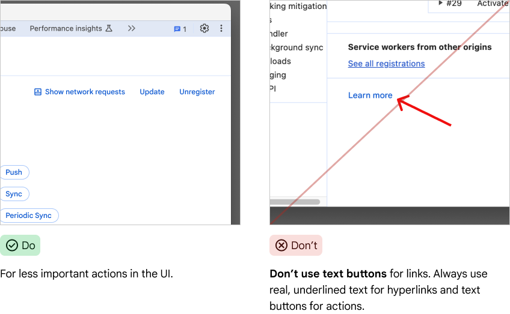
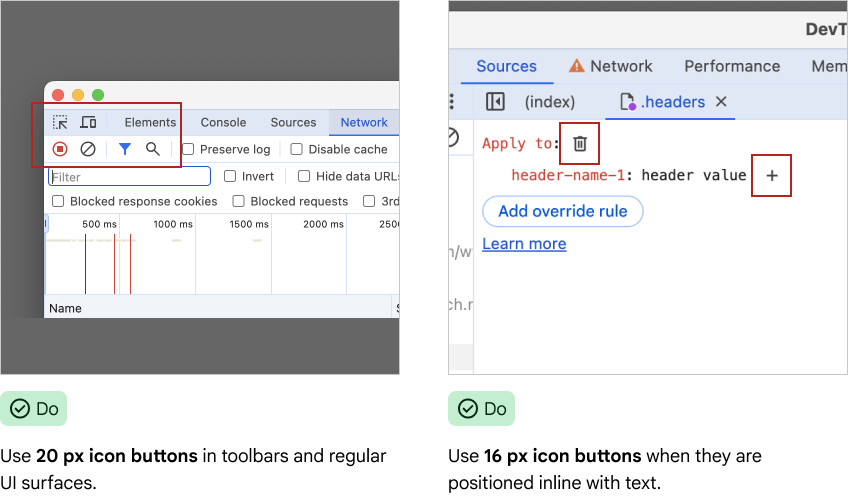

# Components

[TOC]

## Buttons


### Variations

#### Primary buttons


Primary buttons are the most prominent type of button available. They are used
for a single, necessary action a developer must complete, or for a highly
recommended, promoted action. Use them sparingly and with purpose.

#### Tonal buttons


Use tonal buttons in dialogs for actions that stand secondary to a primary
action and are not a cancel or close action.

#### Outlined buttons


Outlined buttons are the default button style. Use them for regular actions in
the UI or to cancel dialogs.

#### Text buttons


Text buttons are the least prominent button choice. Use them in cases outlined
buttons would create too much visual noise.

#### Micro buttons

Micro buttons are used if we have a small line height.

#### Icon buttons


Use icon buttons in toolbars of contextual actions that shouldn’t take up much
space.

### Usage

#### Developer guidelines

##### Dos and Don'ts

###### Do

  * Use
    [`devtools-button`](https://source.chromium.org/chromium/chromium/src/+/main:third_party/devtools-frontend/src/front_end/ui/components/buttons/Button.ts)
    for Primary, Outlined, Text, Micro and Icon buttons
  * Use
    [`ToolbarButton`](https://source.chromium.org/chromium/chromium/src/+/main:third_party/devtools-frontend/src/front_end/ui/legacy/Toolbar.ts;drc=2017cd8a8925f180257662f78eaf9eb93e8e394d;bpv=1;bpt=1;l=555?q=toolbar.ts%20devtools&ss=chromium&gsn=ToolbarButton&gs=KYTHE%3A%2F%2Fkythe%3A%2F%2Fchromium.googlesource.com%2Fcodesearch%2Fchromium%2Fsrc%2F%2Fmain%3Flang%3Dtypescript%3Fpath%3Dfront_end%2Fui%2Flegacy%2FToolbar%23ToolbarButton%2523type)
    for buttons inside
    [`Toolbars`](https://source.chromium.org/chromium/chromium/src/+/main:third_party/devtools-frontend/src/front_end/ui/legacy/Toolbar.ts).
    Underneath they make use of `devtools-button`.

###### Don't

  * Use `<button>`, as they are not styled correctly
  * Change the default color of icons (only in exceptions)

##### Developer examples

###### Primary button

Usage with lit-html:

```js
html`<devtools-button class="some-class"
                      .variant=${Buttons.Button.Variant.PRIMARY}
                      .title=${i18nString(UIStrings.someString)}
                      .jslogContext=${'some-context')}
                      @click=${onClick})></devtools-button>`
```

Usage with the imperative API:

```js
const button = new Buttons.Button.Button();
button.data = {
    variant: Buttons.Button.Variant.PRIMARY,
    title: i18nString(UIStrings.someString),
    jslogContext: 'some-context',
  };
button.classList.add('some-class');
button.addEventListener('click', event => onClick(event));
```

#### Design guidelines

##### Dos and Don'ts

###### Primary Buttons


###### Tonal buttons


#### Outlined buttons


#### Text buttons



#### Icon buttons



### Resources

#### For developers

##### Implementation

  * [`devtools-button`](https://source.chromium.org/chromium/chromium/src/+/main:third_party/devtools-frontend/src/front_end/ui/components/buttons/Button.ts)

#### For designers

##### Figma

  * [Buttons](https://www.figma.com/design/A5iQBBNAe5zPFpJvUzUgW8/CDT-design-kit?node-id=481-2167&m=dev)
  * [Icon
    buttons](https://www.figma.com/design/A5iQBBNAe5zPFpJvUzUgW8/CDT-design-kit?node-id=571-616&m=dev)

## Combo Boxes and Single Select menus


### Usage

#### Developer guidelines

##### Dos and Don'ts

###### Do

  * Use [`<select>`](https://developer.mozilla.org/en-US/docs/Web/HTML/Element/select)
    with [`<option>`](https://developer.mozilla.org/en-US/docs/Web/HTML/Element/option)
    and [`<optgroup>`](https://developer.mozilla.org/en-US/docs/Web/HTML/Element/optgroup)
    if necessary, together with core styles.
  * Override inherited `width` with CSS if necessary.

###### Don't

  * Override the default colors.
  * Introduce custom select components.

##### Developer examples

Usage with lit-html:

```js
html`<select aria-label="Choose your champion"
             @onchange=${onChange}>
  <option hidden value="Choose your champion"></option>
  <option jslog=${VisualLogging.item('hamster').track({click: true})}
          value="Hamster">Hamster</option>
  <option jslog=${VisualLogging.item('mouse').track({click: true})}
          value="Mouse">Mouse</option>
  <option jslog=${VisualLogging.item('cat').track({click: true})}
          value="Cat">Cat</option>
</select>`
```

Usage with the imperative API:

```js
const select = UI.UIUtils.createSelect('Choose your champion', [
  'Hamster',
  'Mouse',
  'Cat',
]);
select.addEventListener('change', event => onChange(event))
```

## Radio Buttons


### Usage

#### Developer guidelines

##### Dos and Don'ts

###### Do

  * Use [`<input type="radio">`](https://developer.mozilla.org/en-US/docs/Web/HTML/Element/input/radio)
    nested within a [`<label>`](https://developer.mozilla.org/en-US/docs/Web/HTML/Element/label)
    for radio buttons, together with core styles.

###### Don't

  * Override the default colors.

##### Developer examples

Usage with lit-html:

```js
const jslog = VisualLogging.toggle().track({change: true}).context(jslogContext);
html`<label><input type="radio" name=${name} jslog=${jslog}>${title}</label>`
```

Usage with the imperative API:

```js
const {label, radio} = UI.UIUtils.createRadioButton(name, title, jslogContext);
radio.addEventListener('change', event => onChange(event))
```

## Sliders


### Usage

#### Developer guidelines

##### Dos and Don'ts

###### Do

  * Use [`<input type="range">`](https://developer.mozilla.org/en-US/docs/Web/HTML/Element/input/range)
    for sliders, together with core styles.

###### Don't

  * Override the default colors.

##### Developer examples

Usage with lit-html:

```js
html`<input type="range"
            min=${min}
            max=${max}
            tabindex=${tabIndex}
            @change=${onChange}>`
```

Usage with the imperative API:

```js
const slider = UI.UIUtils.createSlider(min, max, tabIndex);
slider.addEventListener('change', event => onChange(event))
```

## Icons


### Usage

#### Designer guidelines

Find an exhaustive collection of icons currently used in DevTools [here](https://drive.google.com/corp/drive/folders/1EpmxLRjvdHn5Ia8iT3aicgIEPEvhXY_D?resourcekey=0-QseNsNRsF4w8F5EKz7ncnA)

#### Developer guidelines

##### Dos and Don'ts

###### Do

  * Set class and change color and / or size in .css files

###### Don't

  * Use icons as buttons
  * Use Icon constructor and data setter (deprecated)
  * Use inline styles e.g. `js icon.style.color = ‘some-color’`

##### Developer examples

Usage with lit-html:

```js
html`<devtools-icon name=${'some-icon-name'}></devtools-icon>`
```

Usage with the imperative API:

```js
const someIcon = IconButton.Icon.create('some-icon-name', 'some-class');
```
